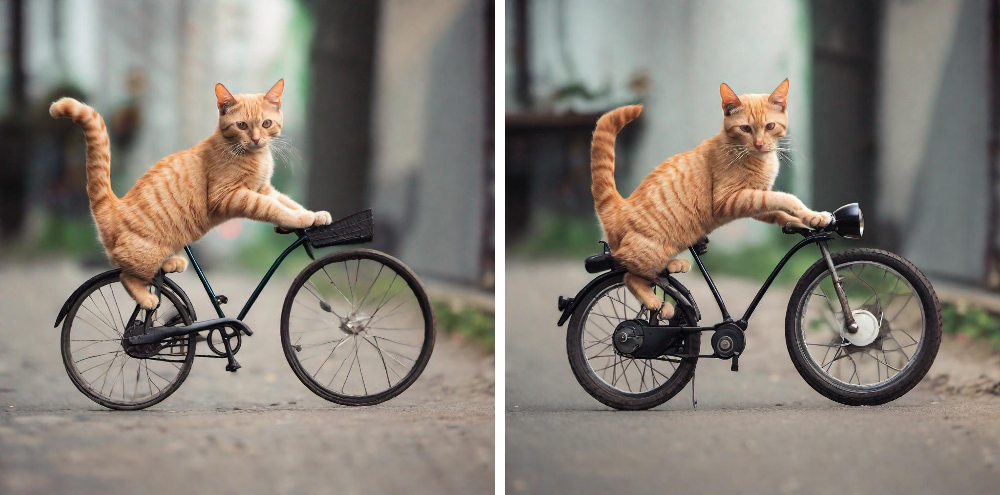
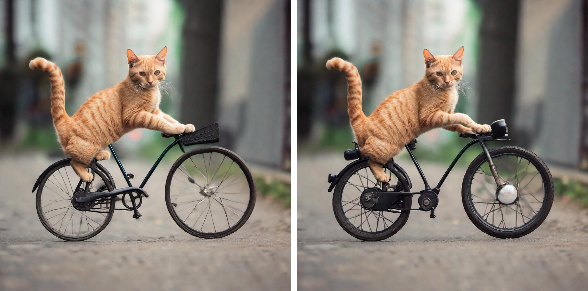
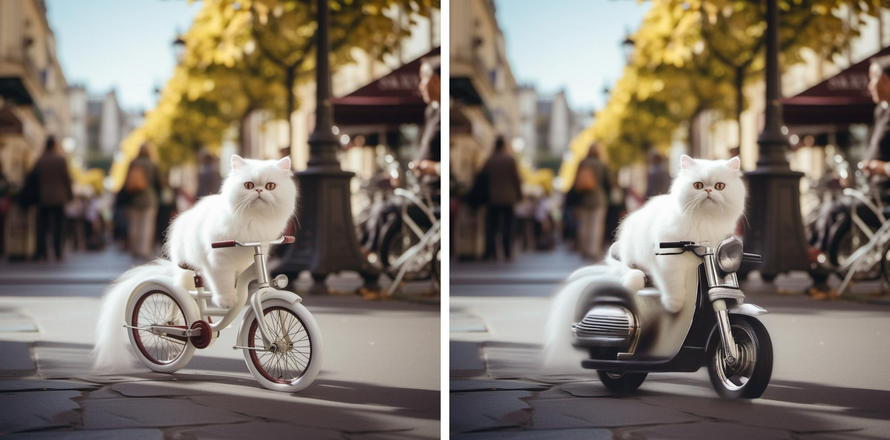
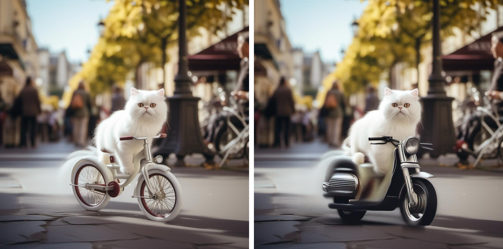
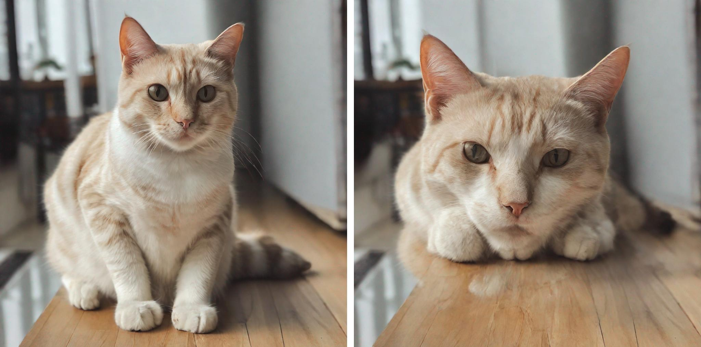
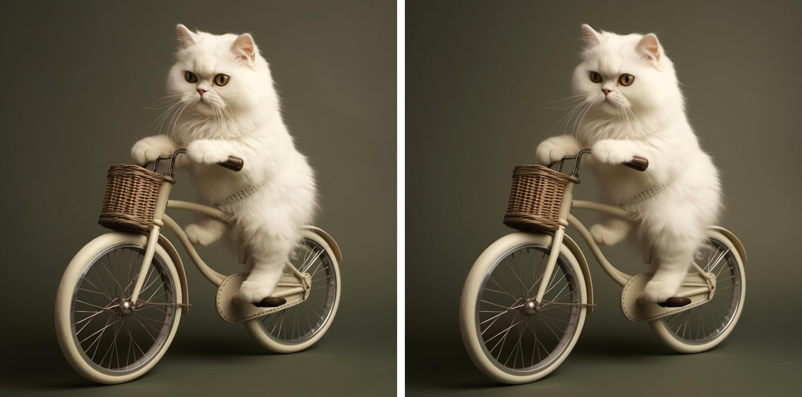

# p2p_sdxl
使用docker:
```dockerfile
docker pull chuke02/sdxl:20230903
```
对应的代码在example.py中。    
ptp:

```python
run_ptp(
    prompts=["Photo of a cat riding on a little bicycle",
            "Photo of a cat riding on a little motorcycle"],
    self_replace_steps = .2,#开始替换自注意力的step
    cross_replace_steps=.3,#开始替换交叉注意力的step
    eq_params = {"words": ("motorcycle",), "values": (1,)},#将motorcycle对应的cross attention乘1
    seed=12345,
    num_ddim_steps=50,
    guidance_scale=7.5,
    use_replace=False,#取False则使用refine，否则使用replace，一般而言refine效果更佳
    model_path="stabilityai/stable-diffusion-xl-base-1.0"
)
```



ptp+localblend:

```python
run_ptp(
    prompts=["Photo of a cat riding on a little bicycle",
            "Photo of a cat riding on a little motorcycle"],
    self_replace_steps = .2,
    cross_replace_steps=.3,
    blend_word = ((('bicycle',), ("motorcycle",))) ,
    eq_params = {"words": ("motorcycle",), "values": (1,)},
    seed=12345,
    num_ddim_steps=50,
    guidance_scale=7.5,
    mask_threshold=0.4,
    start_blend=0.2,
    use_replace=False,
    model_path="stabilityai/stable-diffusion-xl-base-1.0"
)
```

真实图片编辑(Proximal Inversion)+ptp+localblend:
```python
run_ptp(
    prompts=["Photo of a cat riding on a little bicycle",
            "Photo of a cat riding on a little motorcycle"],
    image_path="./example_images/cat_bike3.jpg",
    inv_mode="proxNPI",
    self_replace_steps = .2,
    cross_replace_steps=.3,
    blend_word = ((('bicycle',), ("motorcycle",))) ,
    eq_params = {"words": ("motorcycle",), "values": (1,)},
    seed=12345,
    num_ddim_steps=50,
    guidance_scale=7.5,
    mask_threshold=0.4,
    start_blend=0.2,
    use_replace=False,
    model_path="stabilityai/stable-diffusion-xl-base-1.0"
)
```

4.真实图片编辑(Negative Prompt Inversion)+ptp+localblend:
```python
run_ptp(
    prompts=["Photo of a cat riding on a little bicycle",
            "Photo of a cat riding on a little motorcycle"],
    image_path="./example_images/cat_bike3.jpg",
    inv_mode="NPI", #NPI为Negative Prompt Inversion，proxNPI为Proximal Inversion
    self_replace_steps = .2, #开始替换自注意力的step
    cross_replace_steps=.3, #开始替换交叉注意力的step
    blend_word = ((('bicycle',), ("motorcycle",))) , #保持bicycle和motorcycle并集以外的部分不被编辑
    eq_params = {"words": ("motorcycle",), "values": (1,)}, #将motorcycle对应的cross atten map*1
    seed=12345,
    num_ddim_steps=50, # 采样次数
    guidance_scale=7.5, # 去噪时的CFG(加噪时的CFG为1)
    mask_threshold=0.4,  # localblend确定mask时使用的阈值
    start_blend=0.2, # 从20%的step开始使用localblend
    use_replace=False, # 使用refine,而非replace
    model_path="stabilityai/stable-diffusion-xl-base-1.0"
)
```

5.masa control(用于进行姿态上的编辑):
```python
run_ptp(
    prompts=["a cat is sitting",
        "a cat is laying"],
    self_replace_steps =0.0, #不使用ptp(可以同时使用ptp，但是效果有点奇怪)
    cross_replace_steps=0.0, #不使用ptp
    blend_word = ((('cat',), ("cat",))) ,
    eq_params = None,
    seed=12345,
    num_ddim_steps=50,
    guidance_scale=7.5,
    mask_threshold=0.5,
    start_blend=0.2,
    use_replace=False,
    model_path="stabilityai/stable-diffusion-xl-base-1.0",
    masa_control=True,  # 开启masa control
    masa_mask=False, # 是否使用基于mask的masa control，如果使用，要设定对应的blend_word,有时候似乎有bug?
    masa_start_step=10, #从第step 10开始进行masa control（替换self attention的 kv） 
    masa_start_layer=45, #从unet的第45个cross attention开始替换
    x_t_replace=False, #True的话启用localblend，False的话不用localblend(获取mask但不进行x_t的替换)
)
```

真实图片编辑+ptp是ok的  
真实图片编辑+masa control也是ok的  
ptp+masa control效果会有点怪  
# 仅inversion
见example_inversion.py
```python
# 1. 准备模型
device = torch.device('cuda:0') if torch.cuda.is_available() else torch.device('cpu')
scheduler = DDIMScheduler(
    beta_start=0.00085,
    beta_end=0.012,
    beta_schedule="scaled_linear",
    clip_sample=False, 
    set_alpha_to_one=False
)
model = sdxl.from_pretrained(
    "stabilityai/stable-diffusion-xl-base-1.0", 
    torch_dtype=torch.float16,
    use_safetensors=True, 
    variant="fp16", 
    scheduler=scheduler
)
model.to(device)
num_ddim_steps = 50
inversion = Inversion(model, num_ddim_steps)
prompt="Photo of a cat riding a bike"
inv_mode="proxNPI"
if inv_mode=="proxNPI":
    prox_guidance=True
elif inv_mode=="NPI":
    prox_guidance=False
# 进行inversion
(
    (image_gt, image_enc),  # 分别为原图和inversion效果的上界(用vae encode后立刻decode出来)
    x_T,  # 用于去噪的初始噪声
    x_stars,  # inversion过程中各个step的latent组成的List
    prompt_embeds,  # 原prompt的embdding
    pooled_prompt_embeds # 原prompt的pooled embdding (SDXL有两个embdding)
) = inversion.invert(
    image_path="example_images/cat_bike1.jpg", #图片路径
    prompt=prompt # 原图prompt
)
# 进行infer
image=model(
    prompt=prompt,
    latents=x_T,
    num_inference_steps=num_ddim_steps,
    prox_guidance=prox_guidance, 
    guidance_scale=7.5,
    negative_prompt_embeds=prompt_embeds,
    negative_pooled_prompt_embeds=pooled_prompt_embeds,
    same_init=True,
    x_stars=x_stars,
    return_dict=False
)[0]
view_images([image_gt,image[0]])
```
左边为原图，右边为重建后的图

此外，使用inversion需要在infer的过程中做一些操作，见utils/sdxl_inversion.py中sdxl的__call__方法，以StableDiffusionXLPipeline(diffusers==0.18.2)的__call__为基准，我在增加或修改的代码处做了# ADD 或 # CHANGE的标记，具体内容如下：
添加了三个输入
```python
def __call__(
    self,
    ......
    same_init=False, # ADD ，各个prompt表示是否以同一高斯噪声为起点
    x_stars=None, # ADD ，用于porx inversion
    prox_guidance=False, # ADD ，为False时为negative prompt inversion，反之为porx inversion
    ):
```
实现了same_init
```python
latents = self.prepare_latents(
    batch_size * num_images_per_prompt,
    num_channels_latents,
    height,
    width,
    prompt_embeds.dtype,
    device,
    generator,
    latents,
    same_init=same_init #ADD
)
```
在porx inversion中对noise_con和noise_uncond的差做了正则
```python
if do_classifier_free_guidance:
    noise_pred_uncond, noise_pred_text = noise_pred.chunk(2)
    # CHANGE START
    score_delta,mask_edit=self.prox_regularization(
        noise_pred_uncond,
        noise_pred_text,
        i,
        t,
        prox_guidance=prox_guidance,
    )
    noise_pred = noise_pred_uncond + guidance_scale * score_delta
    # CHANGE END
```
实现了porx inversion中的porx guidance
```python
# ADD START
latents = self.proximal_guidance(
    i,
    t,
    latents,
    mask_edit,
    prox_guidance=prox_guidance,
    dtype=self.unet.dtype,
    x_stars=x_stars
)
# ADD END
```